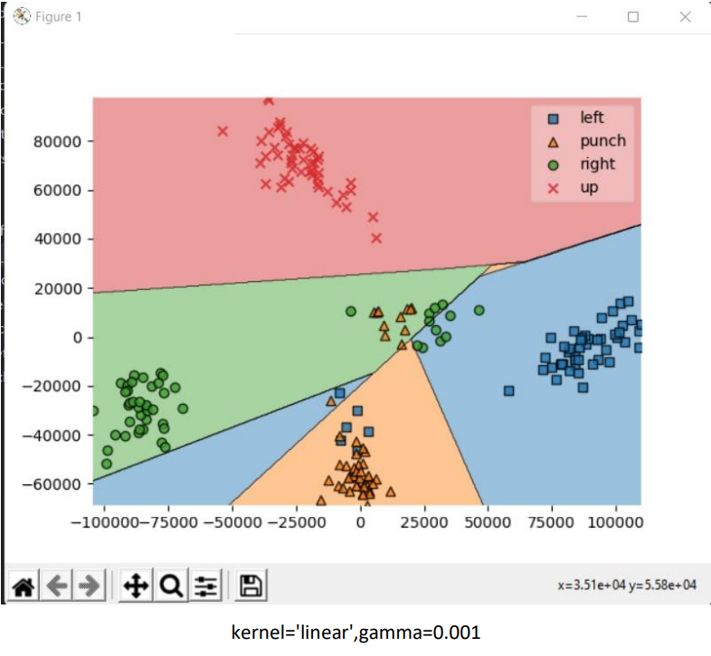
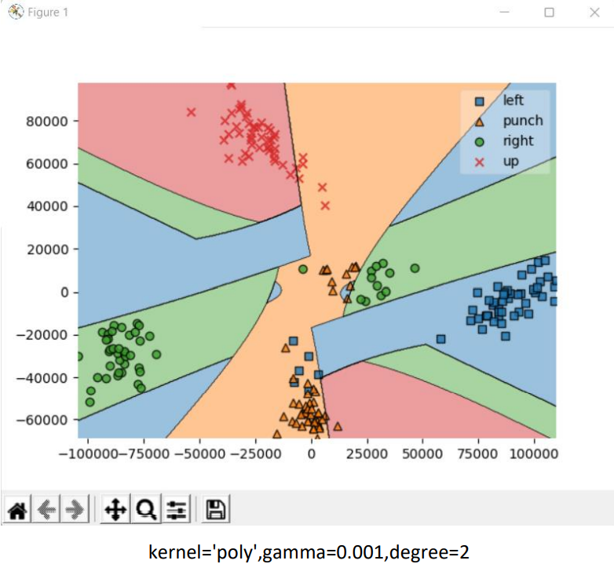
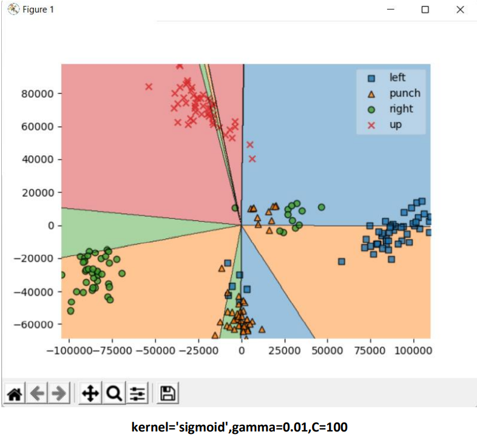
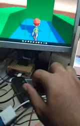

# Gesture-based Game Controller

This project is a simple game controller that uses a Gesture Recognition to control the game.
A sample game implementation is provided to show how to use this project.

## Tools used
Hardware:
- WEMOS D1 Mini(ESP8266)
- Gyroscope sensor(MPU6050)
- Power supply(5V)

Software:
- Arduino IDE
- MPU6050 library
- SVM Classifier
- Unity

## How it works
The game controller is a simple gesture-based game controller. Currently up, left, right, punch are supported.
Limited resources on hardware and real-time performance were considered during the development. Classification is done using SVM classifier.
Training data is manually generated and collected for each gesture. You can find them and script to generate them in the `train_model` folder.

## Data and Model
The data includes 30 consecutive samples of accelerations every 15 miliseconds. each sample is a 3-dimensional vector.
- x-acc: acceleration along the x-axis
- y-acc: acceleration along the y-axis
- z-acc: acceleration along the z-

So each training data is 30*3=90 dimensional vector that is feed to the SVM classifier.

## Demo

